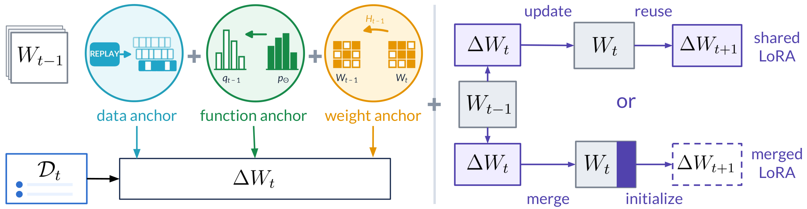
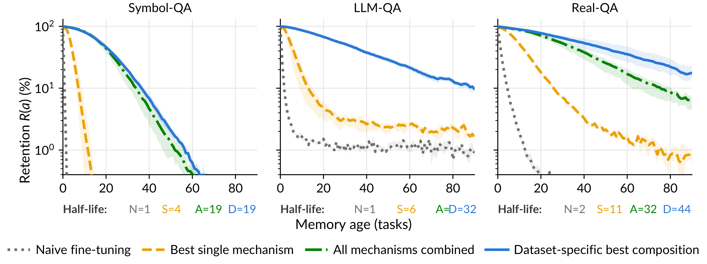

# ComposeCL

Official code and datasets for **Continual Learning Mechanisms Compose for Long-Horizon Memorization**.

[Paper](https://www.alphaxiv.org/abs/2609.compose-cl) · [Project website](https://compose-cl.github.io/) · [Quick start](#quick-start) · [Experiments](#reproduce-the-final-continual-learning-experiments) · [Task-Level Successive Halving](#reproduce-task-level-successive-halving) · [Citation](#citation)

ComposeCL studies how continual learning mechanisms work together to preserve
memory across 100 sequential query-answer tasks. Methods combine two design
dimensions:

- **Anchors** specify what an update should preserve. We use generative replay
  for the data anchor, previous-state self-distillation for the function anchor,
  and SI or online EWC for the weight anchor.
- **Low-rank allocation rules** determine how LoRA updates are retained across
  tasks. We study shared LoRA, merged LoRA, O-LoRA, and a sequential adaptation
  of OSRM.



Combining all three anchors with merged LoRA raises average final retention
after 100 tasks from **1.2% to 34.9%**, a **28-fold improvement** over naive
fine-tuning. This method, `si_sd_replay_merge`, ranks among the **top 3** of the
16 factorial compositions on every dataset.



The [project website](https://compose-cl.github.io/#results) includes an interactive
comparison of all 16 compositions. This repository contains the training and
evaluation pipeline, paper datasets, construction scripts, and analysis tools.
Checkpoints and generated results are not included.

## Quick start

The reported experiments used Python 3.11, Qwen3-4B-Base, bfloat16 training, and
the versions recorded in `requirements.txt`. A CUDA GPU is required for the
paper-scale runs.

```bash
git clone https://github.com/cozheyuanzhangde/compose-cl.git
cd compose-cl

conda create --name compose-cl python=3.11 -y
conda activate compose-cl
python -m pip install --upgrade pip

# If needed, install the PyTorch wheel matching your CUDA driver first.
python -m pip install -r requirements.txt
```

The model is downloaded from Hugging Face on first use. To use a shared cache:

```bash
export HF_HOME=/path/to/huggingface-cache
export TOKENIZERS_PARALLELISM=false
```

No source path, cluster account, scheduler, or cache location is hard-coded.
The launchers inherit `CUDA_VISIBLE_DEVICES`, so they work under a local shell
or an external scheduler.

## Included datasets

| Dataset | Path | Tasks | Items/task | Construction |
|---|---|---:|---:|---|
| Symbol-QA | `data/synthetic_qa/symbol_qa` | 100 | 100 | random six-character keys mapped to random four-character values |
| LLM-QA | `data/synthetic_qa/llm_qa` | 100 | 100 | LLM-generated fictional facts, with task order shuffled using seed 0 |
| Real-QA | `data/real_qa/qwen3_4b_base` | 100 | 50 | ten public QA sources, filtered against Qwen3-4B-Base and globally remixed |

Training and evaluation use the same associations because the target quantity is
memorization retention rather than held-out generalization. Answers are rendered
as `\boxed{answer}` at load time. The stored JSON remains plain text.

The included Real-QA questions were filtered against `Qwen/Qwen3-4B-Base` and
should be paired with that backbone when reproducing the paper.

## Paper hyperparameters

| Component | Setting |
|---|---|
| Backbone | `Qwen/Qwen3-4B-Base` |
| Current task | 10 epochs, batch size 8, gradient accumulation 1, maximum length 384 |
| Optimizer | AdamW, learning rate `5e-4`, weight decay `0.01`, gradient clipping at 1 |
| Schedule | 5% linear warmup followed by a constant rate, restarted per task |
| LoRA | rank 32, alpha 64, dropout 0.05, all attention and MLP projections |
| Data anchor | 300 generations, KL temperature 2, top-p 0.9, generation batch 32, frozen replay token |
| Function anchor | full-vocabulary forward KL, temperature 5, weight 1 in final runs |
| SI | weight 1, damping 0.1 |
| Online EWC | weight 1000, gamma 1, at most 1000 Fisher examples, Fisher normalization enabled |
| O-LoRA | orthogonality weight 0.5, factor-norm weight 0 |
| Sequential OSRM | at most 64 examples per task for input features |

The registered replay loss weights are 0.75 for Symbol-QA, 0.5 for LLM-QA, and
0.75 for Real-QA. The registered replay generation temperature is 1.5 for all
three datasets. These values are centralized in
`experiments/methods.py`.

## Check the commands before running

The final launcher can print every resolved command without loading a model:

```bash
python -m experiments.run_final \
  --dataset symbol_qa \
  --method si_sd_replay_merge \
  --seed 41 \
  --dry-run
```

List the 21 method tags for a dataset:

```bash
python - <<'PY'
from experiments.methods import paper_methods
print("\n".join(paper_methods("symbol_qa")))
PY
```

## Reproduce the final continual-learning experiments

The main evaluation contains:

1. all 16 cells of the `2^4` factorial over SI, self-distillation (`sd`),
   replay, and merged LoRA (`merge`), where the absence of `merge` means
   shared LoRA.
2. the online-EWC, O-LoRA, and sequential-OSRM single mechanisms.
3. O-LoRA and sequential-OSRM replacements for merged LoRA in the
   TSH-selected anchor stack.

Each method is run with seeds 41, 42, and 43 on the default on-disk task
order. A single cell can be run as follows:

```bash
CUDA_VISIBLE_DEVICES=0 python -m experiments.run_final \
  --dataset symbol_qa \
  --method si_sd_replay_merge \
  --seed 41
```

To run every final cell for one dataset sequentially on the visible GPU:

```bash
CUDA_VISIBLE_DEVICES=0 python -m experiments.run_final \
  --dataset symbol_qa \
  --method all \
  --seed 41 42 43
```

Repeat with `llm_qa` and `real_qa`. For a cluster, dispatch one
`(dataset, method, seed)` command per GPU job. These runs are independent.
Training resumes from `resume/state.pt` at task boundaries, and evaluation
resumes from completed matrix rows.

Outputs use this layout:

```text
checkpoints/final/<dataset>/<method>/seed_<seed>/after_task_<t>/
results/final/<dataset>/<method>/seed_<seed>/results.json
```

`results.json` contains the temporal accuracy matrix, auditable generations,
paper metrics, timing, and run hyperparameters. For merged LoRA and
sequential OSRM, the launcher prunes intermediate full-model checkpoints only
after the complete matrix is written. Pass `--keep-intermediate-checkpoints`
to retain them.

## Reproduce Task-Level Successive Halving

**Task-Level Successive Halving (TSH)** seeks preliminary evidence for the
hypothesis that combining multiple anchors with merged LoRA improves retention.
It progressively increases the number of tasks for surviving methods and uses
a task order fixed by `task_order_seed=1234`. The final experiments use the
default on-disk order without that option.

Inspect the 90-candidate funnel:

```bash
python tsh/run.py tsh/configs/symbol_qa.yaml --dry_run
```

Run it on four GPUs:

```bash
PY="$(command -v python)" \
  python tsh/run.py tsh/configs/symbol_qa.yaml \
  --gpus 0,1,2,3 --per_gpu 1
```

Use `tsh/configs/llm_qa.yaml` and `tsh/configs/real_qa.yaml` for the other
datasets. TSH evaluates 90, 45, 23, and 10 configurations at horizons 10, 20,
50, and 100, respectively. Each score is final retention averaged over all
three training seeds before pruning. See `tsh/README.md` for output and resume
details.

## Aggregate the continual-learning metrics

After all three seeds of a dataset finish:

```bash
python analysis/summarize.py --dataset symbol_qa
python analysis/summarize.py --dataset llm_qa
python analysis/summarize.py --dataset real_qa
```

This writes `metrics_summary.json` and `metrics_summary.md` under each
dataset's result directory. Reported metrics are computed from the temporal
accuracy matrix `M`:

- **Final retention (`Final`)**: mean accuracy over all tasks after the last update.
- **Immediate acquisition (`Diag`)**: mean of the diagonal.
- **Forget**: average drop from each task's best observed accuracy to its final
  accuracy.
- **W(k)**: final accuracy over the `k` most recent tasks.

Run the full factorial analysis after all three summaries exist:

```bash
python analysis/factorial.py --results-root results/final
```

Reports are written to `analysis/outputs/`.

## Reproduce general capability evaluation

The paper evaluates GSM8K, MATH, MGSM, and MMLU-Redux after task 100. The first
three use four-shot generation and Math-Verify. MMLU-Redux uses answer-letter
log likelihood.

For a final method checkpoint:

```bash
CUDA_VISIBLE_DEVICES=0 python -m experiments.evaluate_capability \
  --dataset symbol_qa \
  --method si_sd_replay_merge \
  --seed 41
```

For the unmodified base-model reference:

```bash
CUDA_VISIBLE_DEVICES=0 python -m experiments.evaluate_capability \
  --dataset symbol_qa \
  --method base_model
```

The matched allocation comparison uses:

| Dataset | merged LoRA | O-LoRA replacement | Sequential OSRM replacement |
|---|---|---|---|
| Symbol-QA | `si_sd_replay_merge` | `si_sd_replay_olora` | `si_sd_replay_osrm` |
| LLM-QA | `si_replay_merge` | `si_replay_olora` | `si_replay_osrm` |
| Real-QA | `si_replay_merge` | `si_replay_olora` | `si_replay_osrm` |

Capability results are stored below
`results/final/<dataset>/<method>/general_eval/`. This matched comparison retains
the anchors selected by TSH. It is distinct from the fixed cross-dataset method
`si_sd_replay_merge` highlighted above.

## Rebuild the datasets

The exact task files used in the paper are already included. The construction
scripts are provided for provenance and controlled regeneration. Write rebuilt
data to a separate directory before comparing it with the release copy.

Symbol-QA is deterministic:

```bash
python data_generation/synthetic_qa/symbol_qa.py \
  --n_tasks 100 --items_per_task 100 --seed 42 \
  --output_dir rebuilt_data/symbol_qa
```

LLM-QA uses Qwen3-4B-Instruct-2507. Generate the thematic stream, then apply the
paper's fixed task permutation:

```bash
python data_generation/synthetic_qa/llm_qa.py \
  --n_tasks 100 --items_per_task 100 --seed 42 \
  --generator_model Qwen/Qwen3-4B-Instruct-2507 \
  --output_dir rebuilt_data/llm_qa_thematic

python data_generation/synthetic_qa/shuffle_task_order.py \
  --input_dir rebuilt_data/llm_qa_thematic \
  --output_dir rebuilt_data/llm_qa \
  --seed 0
```

Real-QA construction additionally requires `datasets`, `openai`, and
`vllm`. It downloads and normalizes the ten sources, serves Qwen3-4B-Base,
draws five completions per candidate, removes any item for which a completion
contains a gold answer or alias, builds the source-blocked stream, and finally
applies the global seed-42 remix:

```bash
python -m pip install datasets openai vllm
python data_generation/real_qa/generate_real_qa.py load --splits train

python data_generation/real_qa/generate_real_qa.py run \
  --model_name qwen3_4b_base \
  --hf_id Qwen/Qwen3-4B-Base \
  --tp 2 --splits train

python data_generation/real_qa/generate_real_qa.py build \
  --model qwen3_4b_base --n 50 --subtasks 10 --seed 42 \
  --out_root rebuilt_data/real_qa_blocked

python data_generation/real_qa/remix_real_qa.py \
  --src_root rebuilt_data/real_qa_blocked \
  --out_root rebuilt_data/real_qa \
  --models qwen3_4b_base --seed 42 --n 50
```

LLM sampling and GPU kernels can vary across software and hardware versions.
the committed task files are the authoritative inputs for reproducing the
reported training runs.

## Repository layout

```text
train.py                         continual training engine
evaluate.py                      temporal accuracy-matrix evaluation
core/                            anchors, allocation rules, replay, and resume state
experiments/
  methods.py                     paper datasets, hyperparameters, and 21-method design
  run_final.py                   portable final-experiment launcher
  evaluate_capability.py         GSM8K, MATH, MGSM, and MMLU-Redux evaluation
tsh/
  run.py                         Task-Level Successive Halving
  configs/                       TSH settings for the three datasets
analysis/
  summarize.py                   per-seed and aggregate continual-learning metrics
  factorial.py                   full 2^4 factorial analysis
data/                            paper datasets and general capability evaluation sets
data_generation/                 construction scripts for the three datasets
evals/                           math and multiple-choice evaluators
docs/assets/                     paper illustrations used in this README
tests/                           CPU unit tests
CITATION.cff                     machine-readable software and paper citation
```

## Tests

The focused CPU suite does not download a model:

```bash
python -m pytest -q
```

The tests cover the paper experiment registry and TSH funnel, SI, online EWC,
O-LoRA, sequential OSRM, boxed-answer formatting, parsers, previous-state
teacher semantics, and memory logging. TSH and final-launcher dry runs are also
safe preflight checks.

## Practical notes

- A complete three-dataset reproduction is expensive: TSH and the final
  temporal matrices require many long Qwen3-4B runs.
- Full `100 × 100` evaluation stores generations and can produce large JSON
  files. Run `analysis/summarize.py` on a machine with adequate host memory.
- O-LoRA and sequential OSRM retain state that grows linearly with the number
  of tasks. Shared LoRA and merged LoRA retain constant-size learner state
  with respect to the number of tasks.
- No task identifier is supplied at inference.

## Citation

If you use this code or data, please cite:

```bibtex
@article{zhang2026continual,
  title  = {Continual Learning Mechanisms Compose for Long-Horizon Memorization},
  author = {Zhang, Zheyuan and Zhang, Alvin and Khashabi, Daniel and Shu, Tianmin},
  year   = {2026}
}
```
